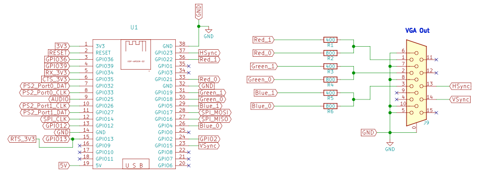
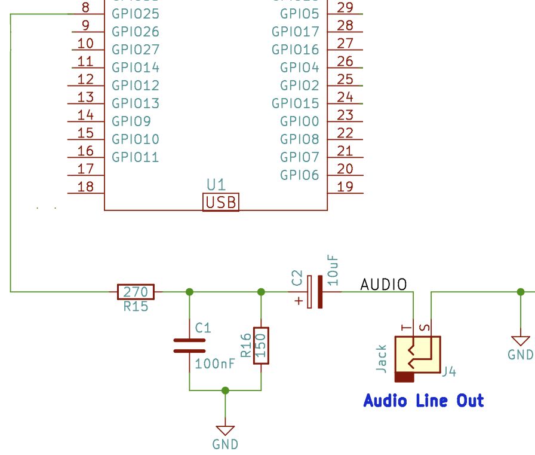

# Organización del Hardware
En este documento se detallará la organización física de la consola, que
componentes se esperan usar y las tecnologías que usaremos usaremos.  
Las conexiones físicas se realizaran a través de los GPIOs disponibles en el
ESP32 DEVKIT V1, este kid de desarrollo dispone de 30 pines en su totalidad,
11 de los cuales se pueden usar como GPIOs sin ningún problema,
adicionalmente hay pines marcados como GPIO que solo funcionan para
lectura de datos.
- **Pines útiles solo para lectura de datos**: GPIO34, GPIO35, GPIO36 y
  GPIO39.
- **GPIOs no disponibles en este devkit**: GPIO20 y GPIO24.

## Controles
Los controles serán físicos: dos botones y un joystick para cada jugador,
siendo dos jugadores en total.  
La conexión interna será por Bluetooth a través de un mando de Playstation 3.

### Alternativa con multiplexor
A continuación se menciona una alternativa con un multiplexor que quedará
solo como una segunda opción en caso de haber alguna complicación al
implementar una entrada por el mando bluetooth.  
Entrada manejada por un multiplexor de 8 a 1 o uno de 16 a 1 en caso de
desear jugar con dos jugadores, así podemos seleccionar una de las varias
entradas para que pase por un solo canal, reduciendo así el uso total de
pines en el microcontrolador.  
El pin utilizado como canal de entrada podría ser preferiblemente uno de solo
entrada; dependiendo de si usamos controles analógicos o no, también se
necesitará que el pin tenga un ADC.

## Video
Para generar video con la tecnología escogida son necesarios 8 pines para, la
configuración predeterminada usa los pines del lado derecho del devkit.
Se tendrán tres DACs de 2-bits para dar una salida de 64 colores lo que suma
6 pines, los otros 2 pines serán usado para sincronización vertical y
horizontal.  

## Audio
Con la información dada por la biblioteca, la salida es obligatoriamente dada
por el GPIO25. El diseño final para la salida de audio no será necesariamente
este ya que se desea un sonido de buen volumen.

## Referencia
- [VGA output schema](http://www.fabglib.org/conf_v_g_a.html). Esquema y
  posibles configuraciones para salida de video VGA.
- [Configuring Audio port](http://www.fabglib.org/conf_audio.html). Base para
  construir el circuito generador de audio.
- [ESP32 Pinout
  Reference](https://randomnerdtutorials.com/esp32-pinout-reference-gpios/)

# Organización del software
## Separación de los juegos
Cada juego contará con sus propias escenas y estructuras para manejar las
mecánicas de los juegos, por lo que haremos una separación lógica entre los
juegos y además habrá lógica unificada común a todos los juegos que servirá
para registrar el estado de la consola. Terminaríamos con una jerarquía 
Estado -> Juego -> Escenas -> Elementos:
- Juego: es el espacio donde están declarados los controladores para pantalla
  y objetos de mayor uso entre las escenas del juego.
- Escena: Contiene la lógica pertenecientes a los objetos que estarán en
  pantalla en un solo espacio, es decir, en una sola escena.
- Elementos: elementos individuales participantes de una escena.

### Estado global
Representación lógica de la consola, en este estado se pueden acceder a los
valores de parámetros, funciones necesarias para registrar aspectos de los
juegos, funciones útiles y funciones para manejar dispositivos externos de
entrada y salida necesarios para la consola.  
Esta representación será dada simplemente por un namespace y su inicialización
será dada con una función `init()`.

#### Funciones para obtener parámetros
- Tiempo que ha lleva el juego actual en ejecución.

#### Funciones de registro
- Función para registrar que un juego fue iniciado. Esta será obligatoriamente
  llamada por cada juego.

#### Dispositivos de entrada y salida
- Control de PS3
- Controlador de VGA provisto por FabGL. En caso de ser necesario habrá
  elementos para facilitar el cambio entre VGAController y
  VGADirectController.

### Juegos
Los juegos agrupan escenas propias donde cada juego tiene escenas únicas por
lo que su manejo será distinto para cada uno. Las representaciones de juegos
serán agrupadas por namespaces también teniendo una función `start()` que
manejará la lógica interna de cada juego.
