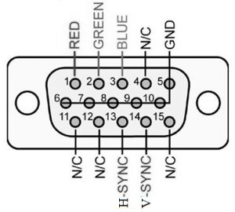
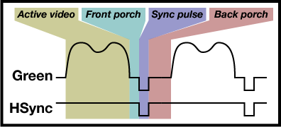

# VGA
Video Gate Array es un estándar para transmitir información en forma de vídeo.
Los colores son indicados por tres pines dentro del conector, cada uno de
ellos definiendo los colores RGB con voltajes analógicos en combinaciones que
van de 0 Volts a 0.7 Volts, una corriente mínima es requerida en caso
contrario el dispositivo no podría detectar correctamente los voltajes.  
Adicionalmente el estándar requiere de dos señales de sincronización:
sincronización horizontal (H-SYNC) y sincronización vertical (V-SYNC).
Donde la sincronización horizontal ocurre a una frecuencia bastante mayor que
la sincronización vertical. Estas señales siguen lógica TTL y generalmente
están son activas en bajo, es decir, cuando la sincronización está activa
estas señales son de 0V.  
La siguiente imagen muestra un puerto VGA con sus pines y sus nombres:
  
Cada resolución tiene una frecuencia específica a la que se dibuja cada
pixel, a esto se le llama "pixel clock", este frecuencia va en el orden de los
MHz siendo las más lentas de un poco más de 10 MHz. Esto supone un reto para
la mayoría de microcontroladores, debido a que es una frecuencia bastante
alta.

## Resistencia
El estándar VGA define que la resistencia interna de todos los puertos VGA sea
de 75Ω. La resistencia de todos los cables para VGA será de 0.7Ω.

## Porches
El dibujado de pixeles en pantalla incluye a otras secciones adicionales
cuya duración también es especificada en pixeles, estas se caracterizan por
tener el "rayo de dibujado" (no conozco la palabra apropiada xd) apagado y no
mostrar nueva información en pantalla. Estas son:
- Señal de sincronización horizontal. La duración especificada en que la
  sincronización debe de estar activa 
- Señal de sincronización vertical. Duración especificada de la
  sincronización vertical.
- Porches frontales. Tiempo anterior a cualquier señal de sincronización en
  donde no se envía información al dispositivo.
- Porches traseros. Tiempo después al de una señal de sincronización en el
  cual tampoco se envía una información significativa, esta suele durar más
  que el porche frontal.  

Hay que tomar en cuenta que cada fabricante tiene un tiempo distinto para cada
uno de estas señales, hay algunas medidas que son estandarizadas que pueden
funcionar como base.  
Consecuencias de tiempos de porches no tan correctos es la
visualización de imágenes desfasadas en la pantalla (no se ve toda la imagen).
Dependiendo del monitor también se tendrá problemas para dibujar en pantalla
si los pines para los colores tienen algún valor distinto a 0V mientras se
envía una señal de sincronización.  
  

## Referencias
- [VGA Video](https://web.mit.edu/6.111/www/s2004/NEWKIT/vga.shtml)
- [Understanding 75 Ohm video signals](
  https://chipnetics.com/tutorials/understanding-75-ohm-video-signals/)
- [bit74.txt](https://lateblt.tripod.com/bit74.txt)
